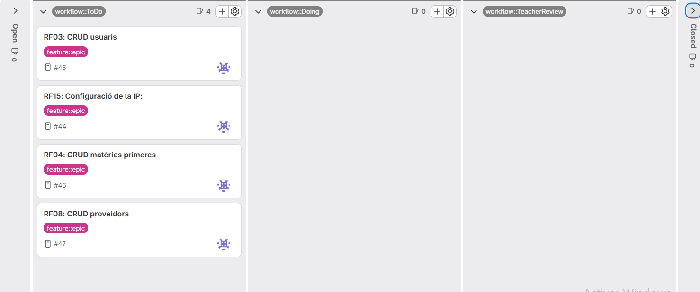
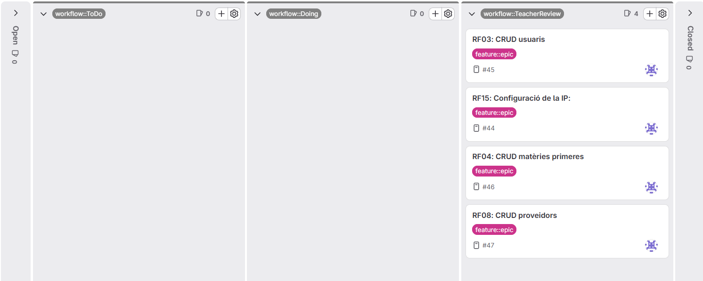
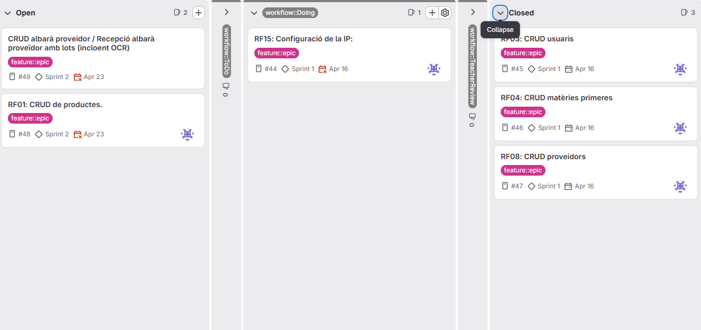
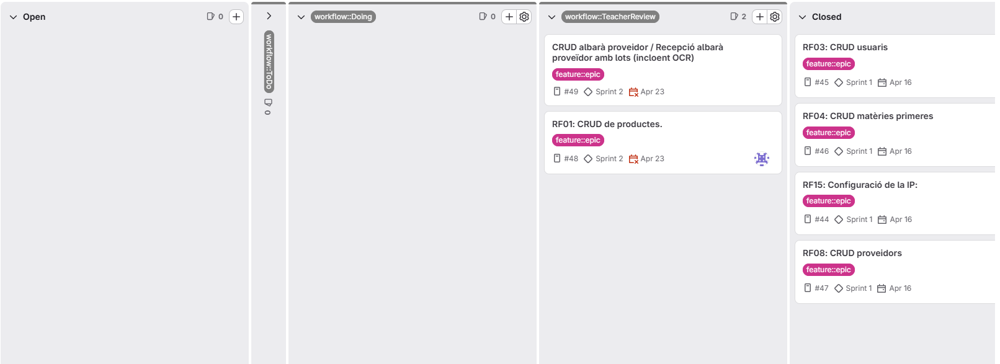
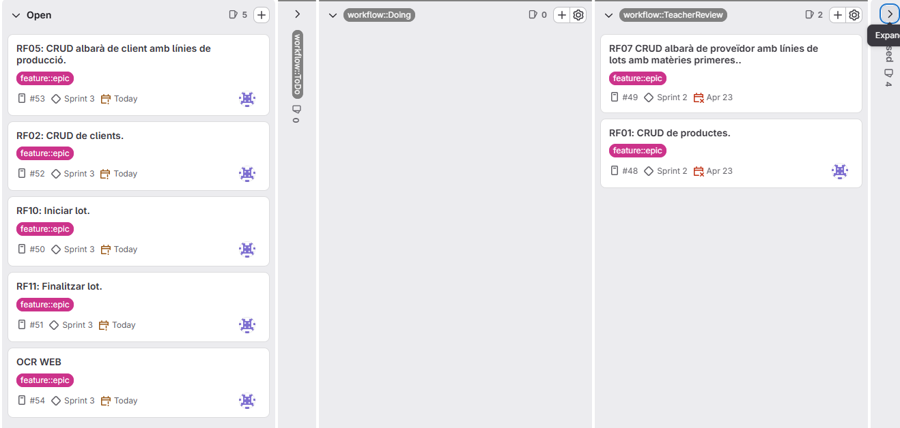
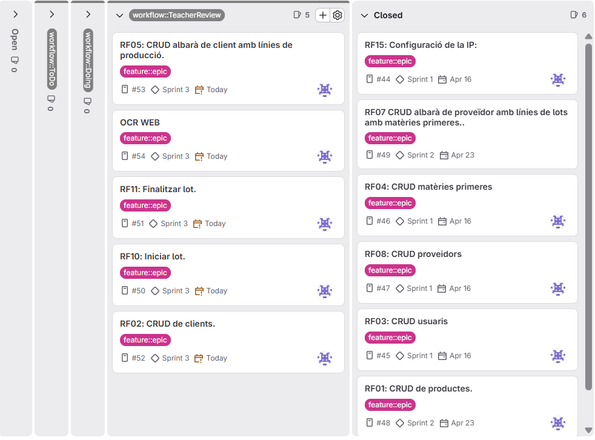
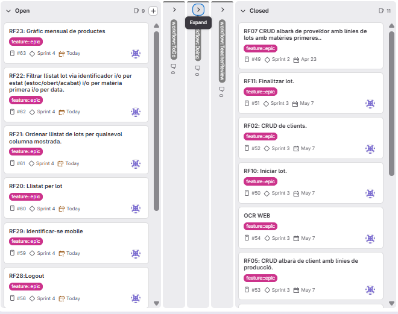
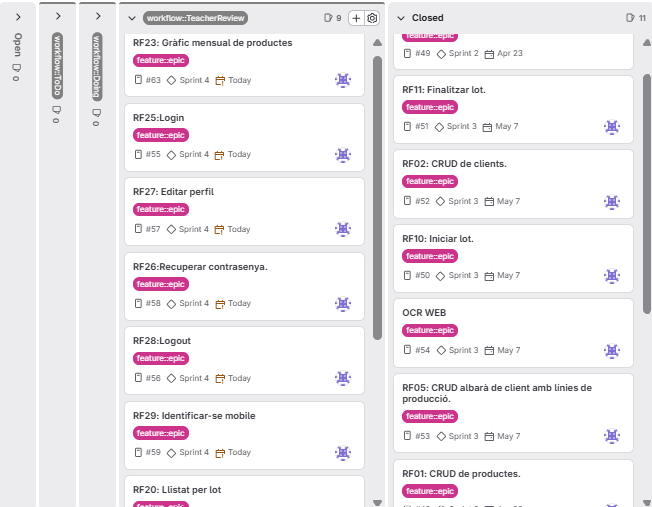

= Documentació PR4
:toc:
:toclevels: 5
:toc-title: Index

= Sprint 1

== Planificació inicial (Primer dia)

Board filtrat pel milestone del Sprint.

== Planificació final (Últim dia)

Board final del Sprint.

== Daily Stand Up

=== Dia 1 — 10/04/2026

[cols="2,2,2,1", options="header"]
|===
|Què es va fer ahir |Què es farà avui |Problemes / preocupacions |Hores

|Explicació de com funcionara el projecte.
|Creació de l’estructura del projecte + començar a fer RF15: Connexions, RETROFIT, Opcions de configuració (IP,...)
|Entendre el projecte i requisits
|6h / 0h
|===

=== Dia 2 — 13/04/2026

[cols="2,2,2,1", options="header"]
|===
|Què es va fer ahir |Què es farà avui |Problemes / preocupacions |Hores

|Creació de l’estructura del projecte + començar a fer RF15: Connexions, RETROFIT, Opcions de configuració (IP,...)
|Acabar el projecte i començar a fer les entitats dels requisits funcionals.
|Dubtes inicials
|6h / 0h
|===

=== Dia 3 — 14/04/2026

[cols="2,2,2,1", options="header"]
|===
|Què es va fer ahir |Què es farà avui |Problemes / preocupacions |Hores

|Acabar el projecte i començar a fer les entitats dels requisits funcionals.
|Fer el RF08: CRUD proveïdors amb les seves pantalles i funcionalitats
|Com fer que els botons tinguessin una bona funcionalitat i sense errors.
|0h / 5h
|===

=== Dia 4 — 15/04/2026

[cols="2,2,2,1", options="header"]
|===
|Què es va fer ahir |Què es farà avui |Problemes / preocupacions |Hores

|Fer el RF08: CRUD proveïdors amb les seves pantalles i funcionalitats
|Fer el RF04: CRUD matèries primeres amb les seves pantalles i funcionalitats
|Com fer que els botons tinguessin una bona funcionalitat i sense errors.
|3h / 1h
|===

=== Dia 5 — 16/04/2026

[cols="2,2,2,1", options="header"]
|===
|Què es va fer ahir |Què es farà avui |Problemes / preocupacions |Hores

|Fer el RF04: CRUD matèries primeres amb les seves pantalles i funcionalitats
|Fer el RF03: CRUD usuaris amb les seves pantalles i funcionalitats + Documentació
|Fer que l'admin només pogues eliminar a altres admins i no a si mateix
|4h / 2h
|===

== Retrospective Meeting

=== Aspectes positius

* Bona organització del projecte.
* Pantalles ben estructurades.
* Connexió amb el frontend establerta.
* Bon seguiment del Sprint.

=== Aspectes a millorar

* Problemes amb CORS.
* Dificultats amb l’arquitectura inicial.
* Alguns errors de configuració.

=== Accions concretes

* Revisar configuració abans de començar.
* Fer proves més petites abans d’integrar.
* Planificar millor les tasques diàries.

= Sprint 2

== Planificació inicial (Primer dia)

Board filtrat pel milestone del Sprint.

== Planificació final (Últim dia)

Board final del Sprint.

== Daily Stand Up

=== Dia 1 — 17/04/2026

[cols="2,2,2,1", options="header"]
|===
|Què es va fer ahir |Què es farà avui |Problemes / preocupacions |Hores

|Fer el RF03: CRUD usuaris amb les seves pantalles i funcionalitats + Documentació
|Correció Sprint 1 + mirar requisits sprint 2
|Entendre els requisits
|6h / 0h
|===

=== Dia 2 — 20/04/2026

[cols="2,2,2,1", options="header"]
|===
|Què es va fer ahir |Què es farà avui |Problemes / preocupacions |Hores

|Correció Sprint 1 + mirar requisits sprint 2
|Fer CRUD producte final
|Mirar el OCR
|6h / 0h
|===

=== Dia 3 — 22/04/2026

[cols="2,2,2,1", options="header"]
|===
|Què es va fer ahir |Què es farà avui |Problemes / preocupacions |Hores

|Fer CRUD producte final
|Fer CRUD albarà proveïdor i intentar fer el OCR.
|Fer el OCR
|3h / 0h
|===

=== Dia 4 — 23/04/2026

[cols="2,2,2,1", options="header"]
|===
|Què es va fer ahir |Què es farà avui |Problemes / preocupacions |Hores

|Fer CRUD albarà proveïdor i intentar fer el OCR.
|Intentar fer el OCR + Documentació
|Com fer el OCR funcional.
|4h / 2h
|===

== Retrospective Meeting

=== Aspectes positius

* S’ha completat el CRUD d’usuaris amb les seves pantalles i documentació.
* S’ha avançat correctament en la correcció del Sprint 1 i inici del Sprint 2.
* Implementació del CRUD de producte final.

=== Aspectes a millorar

* Dificultat inicial per entendre els requisits del Sprint 2.
* Problemes i incertesa en la implementació de l’OCR durant diversos dies.
* Falta de claredat en com fer funcional l’OCR.

=== Accions concretes

* Revisar i entendre bé els requisits abans de començar una tasca.
* Investigar prèviament com implementar funcionalitats complexes com l’OCR.
* Dividir tasques grans en parts més petites i assolibles.

= Sprint 3

== Planificació inicial (Primer dia)

Board filtrat pel milestone del Sprint.

== Planificació final (Últim dia)

Board final del Sprint.

== Daily Stand Up

=== Dia 1 — 24/04/2026

[cols="2,2,2,1", options="header"]
|===
|Què es va fer ahir |Què es farà avui |Problemes / preocupacions |Hores

|Intentar fer el OCR + Documentació
|Correció Sprint 2 + mirar requisits sprint 3
|Entendre els requisits
|6h / 0h
|===

=== Dia 2 — 27/04/2026

[cols="2,2,2,1", options="header"]
|===
|Què es va fer ahir |Què es farà avui |Problemes / preocupacions |Hores

|Correció Sprint 1 + mirar requisits sprint 2
|Vaig continuar amb la correcció dels errors del sprint2
|Cap
|6h / 0h
|===

=== Dia 3 — 28/04/2026

[cols="2,2,2,1", options="header"]
|===
|Què es va fer ahir |Què es farà avui |Problemes / preocupacions |Hores

|Vaig continuar amb la correcció dels errors del sprint2
|Fer OCR web albarà proveïdor
|Veure com fer per aplicar aquest OCR
|3h / 0h
|===

=== Dia 4 — 29/04/2026

[cols="2,2,2,1", options="header"]
|===
|Què es va fer ahir |Què es farà avui |Problemes / preocupacions |Hores

|Fer OCR web albarà proveïdor
|Continuar amb OCR web albarà proveïdor
|Com fer el OCR funcional.
|4h / 2h
|===

=== Dia 5 — 30/04/2026

[cols="2,2,2,1", options="header"]
|===
|Què es va fer ahir |Què es farà avui |Problemes / preocupacions |Hores

|Continuar amb OCR web albarà proveïdor
|Res
|
|0h / 0h
|===

=== Dia 6 — 01/05/2026

[cols="2,2,2,1", options="header"]
|===
|Què es va fer ahir |Què es farà avui |Problemes / preocupacions |Hores

|RES
|RES
|
|0h / 0h
|===

=== Dia 7 — 04/05/2026

[cols="2,2,2,1", options="header"]
|===
|Què es va fer ahir |Què es farà avui |Problemes / preocupacions |Hores

|RES.
|Iniciar/finalitzar lot.
|Fer que quan obri un lot es tanqui l'altre
|6h / 2h
|===

=== Dia 8 — 05/05/2026

[cols="2,2,2,1", options="header"]
|===
|Què es va fer ahir |Què es farà avui |Problemes / preocupacions |Hores

|Iniciar/finalitzar lot.
|Acabar Iniciar/finalitzar lot + arreglar que quan un lot es iniciat ja no puguis eliminar l'albarà.
|
|0h / 6h
|===

=== Dia 9 — 06/05/2026

[cols="2,2,2,1", options="header"]
|===
|Què es va fer ahir |Què es farà avui |Problemes / preocupacions |Hores

|Acabar Iniciar/finalitzar lot + arreglar que quan un lot es iniciat ja no puguis eliminar l'albarà.
|Començar la part de CRUDS de client + albara-client.
|Veure si hem dona temps a fer els CRUDS bé.
|1h / 4h
|===

=== Dia 10 — 07/05/2026

[cols="2,2,2,1", options="header"]
|===
|Què es va fer ahir |Què es farà avui |Problemes / preocupacions |Hores

|Començar la part de CRUDS de client + albara-client.
|Acabar els CRUDS que vaig començar ahir.
|Veure si hem dona temps a fer els CRUDS bé
|3h / 2h
|===

== Retrospective Meeting

=== Aspectes positius

* S'han corregit errors dels sprints anteriors.
* He avançat en funcionalitats importants com l’OCR dels albarans i la gestió d’inici/finalització de lots.
* Vaig començar i casi completar els CRUDS de client i albarà-client.

=== Aspectes a millorar

* Costa entendre alguns requisits del Sprint 3 i això hem va retardar part del desenvolupament.
* La implementació de l’OCR vhem porta dificultats tècniques i requereix més temps del previst.
* La planificació del temps es pot millorar, ja que alguns dies no vaig poder avançar el projecte.

=== Accions concretes

* Revisar millor els requisits abans de començar cada funcionalitat.
* Dividir les funcionalitats grans en tasques més petites per facilitar el seguiment.
* Dedicar més temps a proves i validacions per detectar errors.

= Sprint 4

Objectius: Completar tasques pendents sprint anterior, Explotació de dades (RF20, RF21, RF22, RF23), Login/logout web (RF25, RF28), Identificar-se mobile (RF29), Editar perfil (RF27), Recuperar contrasenya (RF26).

== Planificació inicial (Primer dia)

Board filtrat pel milestone del Sprint.

== Planificació final (Últim dia)

Board final del Sprint.

== Daily Stand Up

=== Dia 1 — 08/05/2026

[cols="2,2,2,1", options="header"]
|===
|Què es va fer ahir |Què es farà avui |Problemes / preocupacions |Hores

|Acabar els CRUDS de client + albara-client.
|Corregir errors del sprint3 + començar RF20: Explotació de dades + Login/logout web + Mobile login.
|Molts requisits per abordar alhora.
|6h / 0h
|===

=== Dia 2 — 09/05/2026

[cols="2,2,2,1", options="header"]
|===
|Què es va fer ahir |Què es farà avui |Problemes / preocupacions |Hores

|Corregir errors del sprint3 + començar RF20: Explotació de dades + Login/logout web + Mobile login.
|Continuar amb Login/logout web i començar RF21: Informes de vendes.
|Problemes de connexió entre mobile i backend.
|5h / 2h
|===

=== Dia 3 — 12/05/2026

[cols="2,2,2,1", options="header"]
|===
|Què es va fer ahir |Què es farà avui |Problemes / preocupacions |Hores

|Continuar amb Login/logout web i començar RF21: Informes de vendes.
|RF22: Pantalla de perfil i editar perfil (RF27) + RF23: Recuperar contrasenya (RF26).
|Dificultat amb la gestió de sessions i seguretat.
|4h / 3h
|===

=== Dia 4 — 13/05/2026

[cols="2,2,2,1", options="header"]
|===
|Què es va fer ahir |Què es farà avui |Problemes / preocupacions |Hores

|RF22: Pantalla de perfil i editar perfil (RF27) + RF23: Recuperar contrasenya (RF26).
|RF29: Identificar-se mobile + acabar tasques pendents.
|Problemes amb l'OCR i validació de CIF.
|6h / 2h
|===

=== Dia 5 — 14/05/2026

[cols="2,2,2,1", options="header"]
|===
|Què es va fer ahir |Què es farà avui |Problemes / preocupacions |Hores

|RF29: Identificar-se mobile + acabar tasques pendents.
|Finalitzar sprint4 + documentació.
|Errors de Hibernate en transaccions i esborrat de lots.
|8h / 4h
|===

== Retrospective Meeting

=== Aspectes positius

* S’han completat tots els objectius del sprint.
* S’ha aconseguit integrar l’OCR tant en web com en mobile.
* Millora significativa en la gestió d’albarans i lots.
* Implementació correcta del login/logout web i mobile.

=== Aspectes a millorar

* Dificultats tècniques amb Hibernate (cascades i transaccions).
* La validació de CIF va requerir múltiples correccions.
* Problemes amb URLs que contenien caràcters especials (barres).

=== Accions concretes

* Fer proves de transaccions i cascades d’Hibernate al principi del sprint.
* Validar correctament els formats de dades (CIF, dates, etc.).
* Millorar la gestió d’errors a la capa de persistència.
= Documentació Tècnica Addicional

== Justificació de decisions de disseny

=== Backend

* **DemoDataLoader amb @Transactional**: Per facilitar les proves, es carreguen dades de demostració a l'inici. L'ús de `@Transactional` a nivell de mètode va requerir ajustos per evitar violacions de FK per l'ordre d'inserció dels proveïdors.

=== General

* **Thymeleaf per al frontend web**: En lloc d'un SPA (React/Angular), s'usa Thymeleaf per renderitzar HTML al servidor, aprofitant la integració directa amb Spring Boot i evitant la complexitat d'una API separada per al client web.

== Llista final de requeriments implementats

[cols="1,4,1", options="header"]
|===
| ID | Descripció | Estat
| RF01 | CRUD de productes | Completat
| RF02 | CRUD de clients | Completat
| RF03 | CRUD d'usuaris | Completat
| RF04 | CRUD de matèries primeres | Completat
| RF05 | CRUD albarà de client amb línies de producció | Completat
| RF07 | CRUD albarà de proveïdor amb lots de matèries primeres | Completat
| RF08 | CRUD proveïdors | Completat
| RF10 | Iniciar lot | Completat
| RF11 | Finalitzar lot | Completat
| RF15 | Configuració de la IP al client Android | Completat
| RF20 | Llistat de producció per lot | Completat
| RF21 | Ordenar llistat de lots per qualsevol columna | Completat
| RF22 | Filtrar llistat de lots per identificador, estat, matèria primera o data | Completat
| RF23 | Gràfic mensual de productes venuts | Completat
| RF25 | Login web amb correu i contrasenya | Completat
| RF26 | Recuperar contrasenya | Completat
| RF27 | Editar perfil d'usuari | Completat
| RF28 | Logout | Completat
| RF29 | Identificar-se al mobile sense contrasenya | Completat
|===

[cols="1,4,1", options="header"]
|===
| ID | Descripció | Estat
| RN04 | Spring Boot estructurat en capes: servei API REST, lògica de negoci i persistència | Completat
| RN05 | Codi optimitzat, eficient, sense redundàncies | Parcial
| RN06 | Ús òptim de classes, interfícies, mètodes i paquets | Parcial
| RN07 | Documentació del codi amb JavaDoc (Backend) i KDoc (Kotlin) | Parcial
| RN08 | Sistema de logs en fitxers per a errors i excepcions | Completat
| RN09 | Gestió d'excepcions informant l'usuari de manera comprensible i en el seu idioma | Completat
| RNF10 | Gestió amb Git i GitLab amb branques main, develop i feature | Completat
| RN11 | Integració de branques feature/* a develop de forma controlada | Completat
| RN12 | Commits descriptius i autoexplicatius | Completat
| RN13 | Repositori amb carpetes backend, mobile i documentació | Completat
| RN14 | README amb vídeo del projecte i captures de la UI | Completat
| RN25 | Interfície d'usuari atractiva, coherent en colors, tipografies i icones | Completat
| RN26 | UX intuïtiva, eficient i fàcil d'usar | Completat
| RN27 | Operacions asíncrones per evitar bloquejos de la UI | Completat
| RN28 | Disseny responsive adaptatiu | Parcial
| RN29 | Internacionalització en català i castellà | Completat
| RN61 | Autenticació web mitjançant usuari i contrasenya | Completat
| RN62 | Control d'accés a URLs no autoritzades | Completat
| RN63 | Hashing segur de contrasenyes (SHA-256 + Base64) | Completat
| RN64 | Protecció de dades personals davant accessos no autoritzats | Completat
| RN65 | Caducitat de sessió d'usuari | Completat
| RN66 | Xifrat HTTPS amb certificat TLS autosignat | Completat
|===

== Desviacions respecte a la planificació inicial

No hi va haver desviacions significatives respecte a la planificació inicial. Totes les tasques planificades es van completar dins dels terminis previstos.

== Incidències trobades

[cols="1,4,2,2", options="header"]
|===
| ID | Descripció | Impacte | Solució
| INC-05 | Validació de CIF incorrecta per a certs formats | Moderat | Corregir algoritme de validació (suma de dígits parells/senars)
| INC-06 | URLs amb caràcters especials (barres) en albarans | Moderat | Codificar URL amb `encodeURIComponent()`
| INC-07 | Idioma inconsistent a la pantalla OCR del mòbil | Lleu | Substituir strings hardcodejats per `stringResource()`
|===

== Propostes de millora

[cols="2,5", options="header"]
|===
| Area | Millora proposada
| OCR | Fer que l'OCR funcioni al 100%: millorar el preprocessament d'imatge, entrenar Tesseract amb dades específiques d'albarans, o substituir per una API de tercers (Google Vision, Azure Form Recognizer)
| Mobile | Afegir gestió completa d'albarans de client (CRUD) i controls de pH
| Mobile | Afegir notificacions push per a lots propers a caducitat
|===

== Conclusió

El projecte EasyTraza ha permès desenvolupar un sistema complet de traçabilitat
amb una arquitectura moderna basada en Spring Boot (backend) i Jetpack Compose (mobile).
S'han implementat tots els requisits funcionals planificats, incloent-hi la gestió
de lots, albarans de proveïdor i client, OCR amb intel·ligència artificial,
informes de vendes, i autenticació tant web com mòbil.

Tecnològicament, el projecte ha suposat un aprenentatge significatiu en:

* Spring Boot i JPA/Hibernate amb claus compostes i relacions complexes
* Jetpack Compose i Clean Architecture per a Android
* Pipeline OCR amb Tesseract + Groq AI
* Thymeleaf per a renderitzat HTML al servidor
* Internacionalització d'aplicacions (català/castellà)
* Gestió de sessions i seguretat bàsica

Les principals dificultats van ser la implementació de l'OCR (que va requerir
una segona etapa amb IA per ser fiable) i la gestió de transaccions i cascades
d'Hibernate. Ambdues es van resoldre amb les solucions descrites a les incidències.

En conjunt, el resultat és un producte funcional i preparat per a ús real en
un entorn de producció de petita o mitjana escala.
